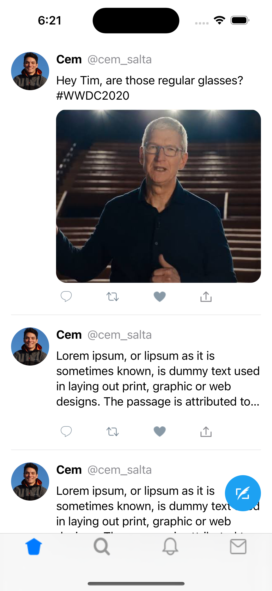

# Twitter Clone - Documentation

Bienvenue dans la documentation du projet Twitter Clone. Ce projet vise à reproduire les fonctionnalités essentielles de la plateforme de médias sociaux Twitter. Il a été développé en utilisant Swift pour iOS et Node.js pour les fonctionnalités côté serveur.

## Fonctionnalités

- Authentification et autorisation des utilisateurs avec JWT.
- Publication et consultation de tweets.
- Profils d'utilisateurs avec avatars et biographies.
- Commentaires sur les tweets.
- Mises à jour en temps réel avec WebSocket (optionnel).
- ...

## Technologies Utilisées

- **Application iOS** :
  - Langage : Swift 5
  - Framework : SwiftUI
  - IDE : Xcode 14
- **Serveur** :
  - Langage : JavaScript (Node.js)
  - Base de données : MongoDB
  - Authentification : JSON Web Tokens (JWT)

## Structure du Projet

- `twitter-clone-ios` : Contient le code source de l'application iOS.
- `twitter-clone-server` : Contient le code source du serveur Node.js.

## Installation

1. Clonez le référentiel : `git clone https://github.com/votre-nom-utilisateur/twitter-clone.git`
2. Configurez le serveur : Consultez `twitter-clone-server/README.md` pour les instructions de configuration du serveur.
3. Compilez et exécutez l'application iOS : Ouvrez `twitter-clone-ios/TwitterClone.xcodeproj` dans Xcode et exécutez l'application sur un simulateur ou un appareil.

## Utilisation

- Connectez-vous ou créez un nouveau compte.
- Publiez des tweets, consultez les profils des utilisateurs et interagissez avec les tweets d'autres utilisateurs.
- Profitez de l'expérience similaire à Twitter avec cette application !

## Capture d'Écran

## Contribution

Nous sommes ouverts aux contributions pour améliorer ce projet. N'hésitez pas à ouvrir des problèmes, soumettre des demandes de fusion ou proposer des suggestions.

## Licence

Ce projet est sous licence MIT. Consultez le fichier [LICENSE](LICENSE) pour plus de détails.
